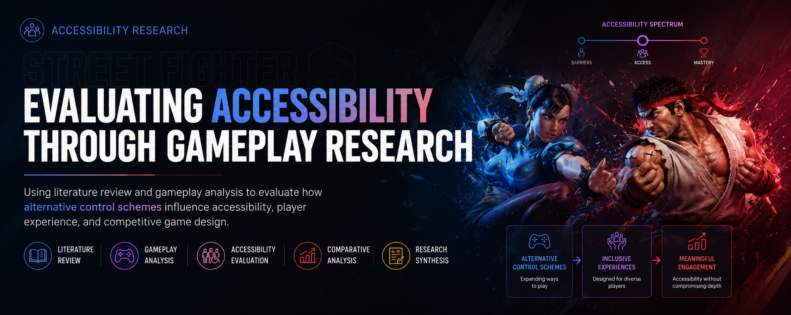

  

<h1 align="center">Evaluating Accessibility Through Gameplay Research</h1>

<b>Accessibility Research</b> • <b>Gameplay Analysis</b> • <b>Literature Review</b> • <b>Product Research</b>

> **Using literature review and gameplay analysis to evaluate how alternative control schemes influence accessibility, player experience, and competitive game design.**

---

# Project Overview

| Category | Details |
|----------|---------|
| **Role** | Researcher |
| **Project Type** | Accessibility Research |
| **Research Focus** | Accessibility, Inclusive Design, Gameplay Analysis |
| **Duration** | Graduate Research Project |
| **Research Methods** | Literature Review, Comparative Analysis, Research Synthesis |
| **Tools** | Academic Literature, Gameplay Analysis, Research Databases |

---

# Executive Summary

Accessibility has become an increasingly important consideration in modern game design. As games continue to reach broader audiences, designers must balance ease of learning, player expression, and long-term mastery while ensuring experiences remain engaging for both new and experienced players.

This project explored accessibility through the lens of alternative control schemes in *Street Fighter 6*. By reviewing existing literature and analyzing design decisions, the research examined how accessibility-focused mechanics can influence learning, player confidence, and competitive play.

Rather than evaluating accessibility solely as a technical feature, this research considered how inclusive design choices can improve player experiences while supporting broader product goals.

---

# Product Challenge

Modern digital products must serve users with diverse backgrounds, abilities, and experience levels.

For competitive games, this creates an important design challenge:

How can products reduce barriers to entry without diminishing long-term engagement or competitive depth?

This research explored how accessibility-focused design decisions can improve learnability while preserving meaningful player choice and mastery.

---

# Why This Matters

Accessibility extends beyond games.

Many digital products must balance simplicity for new users with flexibility for experienced users.

Understanding how accessibility influences user behavior helps teams design products that are:

- Easier to learn
- More inclusive
- More engaging
- Better aligned with diverse user needs

Research allows product teams to evaluate accessibility decisions using evidence rather than assumptions.

---

# Objectives

This research focused on the following objectives.

- Explore accessibility-focused design decisions in modern fighting games.
- Compare alternative control schemes from an inclusive design perspective.
- Review existing literature surrounding accessibility and player experience.
- Identify opportunities for improving learnability and player engagement.
- Translate research findings into practical product recommendations.

---

# My Contribution

As a researcher, I contributed throughout the review process by:

- Conducting literature reviews on accessibility and game design.
- Reviewing research related to player experience and inclusive design.
- Comparing alternative control systems.
- Synthesizing findings across multiple sources.
- Translating research into product-focused insights and recommendations.

---

# Research Approach

This project combined several complementary research methods.

Our approach included:

- Literature review
- Comparative analysis
- Accessibility evaluation
- Gameplay analysis
- Research synthesis

Rather than evaluating a single gameplay feature in isolation, this project synthesized existing research to better understand how accessibility-focused design decisions influence player experience, learning, and long-term engagement.

---

# Key Insights

## Accessibility lowers barriers to entry

Design decisions that reduce complexity can encourage broader participation without necessarily reducing player agency.

## Multiple interaction styles support diverse users

Providing different ways to interact with the same system allows products to accommodate varying levels of experience and ability.

## Learnability influences long-term engagement

Helping users achieve early success increases confidence and encourages continued exploration.

## Accessibility and depth can coexist

Inclusive design does not require sacrificing meaningful challenge or mastery when implemented thoughtfully.

---

# Product Recommendations

Based on the literature and comparative analysis, several opportunities consistently emerged.

## Design for diverse experience levels

Support both beginners and experienced users through flexible interaction models.

## Reduce unnecessary onboarding friction

Lower barriers that prevent new users from engaging with core product experiences.

## Preserve meaningful user choice

Allow users to select interaction methods that best match their goals and abilities.

## Evaluate accessibility throughout development

Accessibility should be considered as part of the design process rather than added after implementation.

---

# Product Applications

Although this project focused on a fighting game, the findings extend to many digital products.

The accessibility principles explored in this research can inform:

- Video games
- Educational technology
- Productivity software
- AI-powered applications
- Consumer products
- Interactive learning platforms

Understanding accessibility helps teams design experiences that welcome a broader range of users while improving overall product quality.

---

# Reflection

## What I Learned

This project strengthened my understanding of accessibility as a product design principle rather than simply a collection of optional features.

Reviewing existing research demonstrated how thoughtful design decisions can improve learnability, confidence, and long-term engagement while supporting a wider range of users.

These lessons continue to influence how I approach product research by considering accessibility alongside usability, user behavior, and product strategy.

---

# Related Resources

📄 Original Review Paper (included in this repository)

🎮 Street Fighter 6

🌐 Portfolio

https://shantanugupta.framer.ai

💼 LinkedIn

https://linkedin.com/in/shantanugupta99
